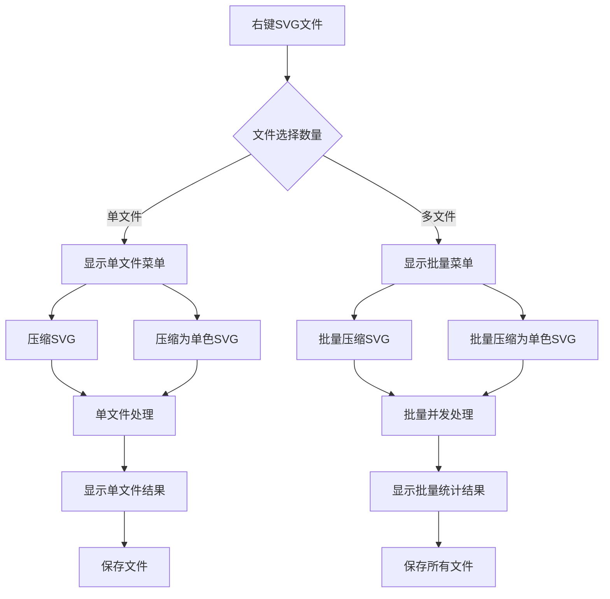

# SVG压缩VSCode插件产品需求文档

## 1. 产品概述

本插件为VSCode提供SVG文件压缩和单色转换功能，通过右键菜单快速优化SVG文件。
- 解决SVG文件体积过大和颜色冗余问题，提升开发者工作效率
- 面向前端开发者、UI设计师和需要处理SVG资源的开发团队
- 提供一键式SVG优化解决方案，减少手动处理工作量

## 2. 核心功能

### 2.1 用户角色

| 角色 | 使用方式 | 核心权限 |
|------|----------|----------|
| 开发者 | 安装插件后直接使用 | 可使用所有SVG压缩和转换功能 |

### 2.2 功能模块

本插件包含以下核心页面和功能：
1. **右键菜单扩展**：在SVG文件上添加压缩选项菜单，支持单文件和批量操作
2. **SVG压缩功能**：使用SVGO 4.0.0+官方默认策略优化SVG文件大小
3. **单色SVG转换**：在默认压缩基础上移除颜色信息，支持CSS继承
4. **批量处理功能**：支持多选SVG文件进行批量压缩和转换
5. **处理结果反馈**：显示单文件或批量处理的压缩结果和统计信息

### 2.3 功能详情

| 功能模块 | 子功能 | 功能描述 |
|----------|--------|----------|
| 右键菜单 | 单文件菜单 | 单选SVG文件时显示"压缩SVG"和"压缩为单色SVG"选项 |
| 右键菜单 | 批量菜单 | 多选SVG文件时显示"批量压缩SVG"和"批量压缩为单色SVG"选项 |
| SVG压缩 | 标准压缩 | 使用SVGO 4.0.0+官方默认配置进行文件优化，支持单文件和批量处理 |
| 单色转换 | 颜色继承 | 在SVGO默认压缩基础上移除fill、stroke等颜色属性；保留currentColor；确保继承父元素颜色 |
| 批量处理 | 并发优化 | 支持多文件并发处理；进度显示；错误处理和重试机制 |
| 结果反馈 | 统计显示 | 单文件：显示压缩前后大小对比；批量：显示总体统计、成功/失败数量、详细结果列表 |

## 3. 核心流程

**单文件操作流程：**
用户右键单个SVG文件 → 选择压缩选项 → 插件处理文件 → 显示处理结果 → 保存优化后的文件

**批量操作流程：**
用户多选SVG文件 → 选择批量压缩选项 → 插件并发处理所有文件 → 显示批量处理统计 → 保存所有优化文件

**详细流程图：**

## 4. 用户界面设计

### 4.1 设计风格

- **主色调**：VSCode主题色（#007ACC蓝色）和成功绿色（#28A745）
- **按钮样式**：扁平化设计，圆角按钮
- **字体**：Segoe UI, 14px主要文字，12px辅助信息
- **布局风格**：简洁的右键菜单项，状态栏通知样式
- **图标风格**：使用VSCode内置图标集，简洁线性图标

### 4.2 界面设计概览

| 界面模块 | 子模块 | UI元素 |
|----------|--------|--------|
| 右键菜单 | 单文件选项 | "压缩SVG"、"压缩为单色SVG"菜单项；图标、文字标签；悬停效果 |
| 右键菜单 | 批量选项 | "批量压缩SVG"、"批量压缩为单色SVG"菜单项；批量图标标识；分隔线 |
| 状态通知 | 单文件反馈 | 进度指示器；成功/错误图标；文件大小对比；压缩比例显示 |
| 状态通知 | 批量反馈 | 批量进度条；总体统计信息；成功/失败文件数量；详细结果列表；展开/收起按钮 |

### 4.3 响应式设计

插件主要在桌面VSCode环境中使用，无需考虑移动端适配。界面元素遵循VSCode主题系统，支持明暗主题切换。