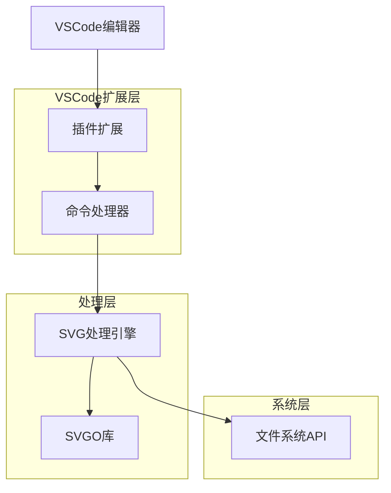
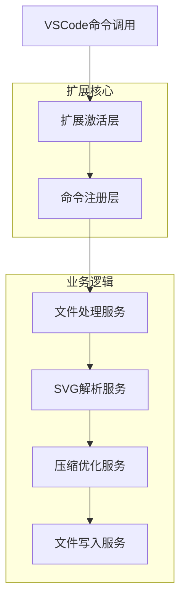
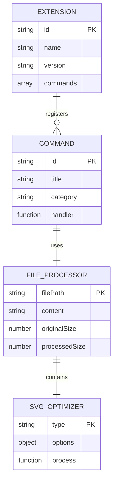

# SVG压缩VSCode插件技术架构文档

## 1. 架构设计



## 2. 技术描述

* Frontend: TypeScript\@5 + VSCode Extension API

* Backend: 无需独立后端服务

* 核心库: SVGO\@4.0.0+ (SVG优化) + VSCode API

## 3. 路由定义

| 命令ID                      | 功能描述                 |
| ------------------------- | -------------------- |
| svg-compress.compress     | SVG压缩命令（支持单文件和多文件）   |
| svg-compress.monoCompress | 单色SVG转换命令（支持单文件和多文件） |

## 4. API定义

### 4.1 核心API

**文件过滤**

```typescript
// 简化的文件过滤器
interface FileFilter {
  filterSvgFiles(filePaths: string[]): string[];
}

// 只检查文件扩展名
function filterSvgFiles(filePaths: string[]): string[] {
  return filePaths.filter(path => path.toLowerCase().endsWith('.svg'));
}
```

**SVG压缩处理**

```typescript
// 使用SVGO 4.0.0+官方默认配置
interface CompressResult {
  success: boolean;
  filePath: string;
  originalSize: number;
  compressedSize: number;
  compressionRatio: number;
  error?: string;
}

interface ProcessResult {
  results: CompressResult[];
  totalOriginalSize: number;
  totalCompressedSize: number;
  successCount: number;
  failedCount: number;
}

// 统一的压缩函数（支持单文件和多文件）
function compressSvg(filePaths: string | string[]): Promise<ProcessResult>
```

**单色转换处理**

```typescript
// 在SVGO默认配置基础上添加颜色继承处理
interface MonoConfig {
  inheritParentColor: boolean; // 默认true，移除颜色属性使其继承父元素
  preserveCurrentColor: boolean; // 默认true，保留currentColor值
}

// 统一的单色转换函数（支持单文件和多文件）
function convertToMono(filePaths: string | string[]): Promise<ProcessResult>
```

**文件操作**

```typescript
interface FileOperation {
  read(filePath: string): Promise<string>;
  write(filePath: string, content: string): Promise<void>;
  backup(filePath: string): Promise<string>;
}
```

**处理示例：**

```json
// 单文件请求
{
  "filePaths": "/path/to/file.svg"
}

// 多文件请求
{
  "filePaths": ["/path/to/file1.svg", "/path/to/file2.svg"]
}

// 统一响应格式
{
  "results": [
    {
      "success": true,
      "filePath": "/path/to/file1.svg",
      "originalSize": 1024,
      "compressedSize": 512,
      "compressionRatio": 0.5
    }
  ],
  "totalOriginalSize": 2048,
  "totalCompressedSize": 1024,
  "successCount": 2,
  "failedCount": 0
}
```

## 5. 服务架构图



## 6. 数据模型

### 6.1 数据模型定义



### 6.2 配置数据结构

**扩展配置 (package.json)**

```json
{
  "name": "svg-mono-compress",
  "displayName": "SVG压缩工具",
  "version": "1.0.0",
  "engines": {
    "vscode": "^1.74.0"
  },
  "categories": ["Other"],
  "activationEvents": [
    "onLanguage:xml"
  ],
  "main": "./out/extension.js",
  "contributes": {
    "commands": [
      {
        "command": "svg-compress.compress",
        "title": "压缩SVG"
      },
      {
        "command": "svg-compress.monoCompress", 
        "title": "压缩为单色SVG"
      }
    ],
    "menus": {
      "explorer/context": [
        {
          "command": "svg-compress.compress",
          "when": "resourceExtname == .svg",
          "group": "7_modification@1"
        },
        {
          "command": "svg-compress.monoCompress",
          "when": "resourceExtname == .svg", 
          "group": "7_modification@2"
        }
      ]
    }
  },
  "scripts": {
    "vscode:prepublish": "npm run compile",
    "compile": "tsc -p ./",
    "package": "vsce package"
  },
  "devDependencies": {
    "@types/vscode": "^1.74.0",
    "@types/node": "18.x",
    "typescript": "^5.0.0"
  },
  "dependencies": {
    "svgo": "^4.0.0"
  }
}
```

**TypeScript配置 (tsconfig.json)**

```json
{
  "compilerOptions": {
    "module": "commonjs",
    "target": "ES2020",
    "outDir": "out",
    "lib": ["ES2020"],
    "sourceMap": true,
    "rootDir": "src",
    "strict": true
  },
  "exclude": ["node_modules", ".vscode-test"]
}
```

## 7. 简化设计说明

### 7.1 文件过滤机制

**简化的文件识别**

* **扩展名检查**：只检查`.svg`扩展名，不验证文件内容

* **无大小限制**：移除文件大小限制，交给SVGO处理

* **统一处理**：单文件和多文件使用相同的处理逻辑

**过滤实现**

```typescript
// 简化的文件过滤实现
function filterSvgFiles(filePaths: string[]): string[] {
  return filePaths.filter(path => path.toLowerCase().endsWith('.svg'));
}
```

### 7.2 统一的处理架构

**简化的错误处理**

* **基础错误处理**：只处理文件读写和SVGO处理错误

* **统一错误格式**：所有错误使用相同的CompressResult格式

* **依赖SVGO**：复杂的SVG验证和处理交给SVGO库

**SVGO原生能力利用**

* **多文件支持**：直接使用SVGO的多文件处理能力

* **官方默认配置**：使用SVGO 4.0.0+的官方默认优化策略

* **无并发控制**：让SVGO自己管理文件处理的并发和性能

### 7.3 菜单简化

**统一菜单条件**

* **单一条件**：只检查`resourceExtname == .svg`

* **自动适应**：同一命令自动处理单文件或多文件选择

* **用户友好**：用户无需区分单文件和批量操作

